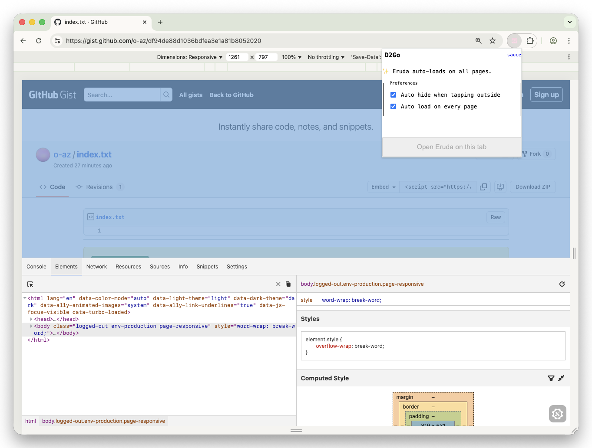

# D2Go - Developer Tools To Go  💨

A nice developer console for your mobile and PC, Chrome, Safari & Firefox.



> [!NOTE]
> Like to edge? We got you covered!
> Edge is supported out of the box.

## Installation

### Chrome

- Chrome Web Store

Download from _TODO_

- manual installation

  - Download the chrome.zip from the GitHub Releases page,
  - Extract the zip file,
  - Open Chrome and navigate to `chrome://extensions/`,
  - Enable Developer Mode,
  - Click on "Load unpacked" and select the extracted folder,
  - The extension should now be loaded,
  - You can now open the extension by clicking on the icon in the toolbar,
  - You can now open the extension by clicking on the icon in the toolbar,

### Firefox Add-ons

Download from _TODO_

- manual installation

- Download the firefox.zip from the GitHub Releases page,
- Extract the zip file,
- Open Firefox and navigate to `about:debugging#/runtime/this-firefox`,
- Enable Developer Mode,
- Click on "Load unpacked" and select the extracted folder,
- The extension should now be loaded,
- You can now open the extension by clicking on the icon in the toolbar,
- You can now open the extension by clicking on the icon in the toolbar,

### Safari Extensions

- Safari Extensions Store

Download from _TODO_

- manual installation

  - Download the safari.zip from the GitHub Releases page,
  - Extract the zip file,
  - Open Safari and navigate to `about:debugging#/runtime/this-safari`,
  - Enable Developer Mode,
  - Click on "Load unpacked" and select the extracted folder,
  - The extension should now be loaded,
  - You can now open the extension by clicking on the icon in the toolbar,
  - You can now open the extension by clicking on the icon in the toolbar,

## Development

Install dependencies:

```sh
bun install
```

Build then run dev server:

```sh
bun run dev
# or
bun run dev:firefox
```

> [!NOTE]
> To pass a custom binary for Edge, FF or Chrome, set the corresponding environment variable.
> `EDGE_BINARY_PATH`, `FIREFOX_BINARY_PATH`, `CHROME_BINARY_PATH`
> Then pass `--env-file=.env` to the commands: `bun --env-file=.env dev:firefox`
